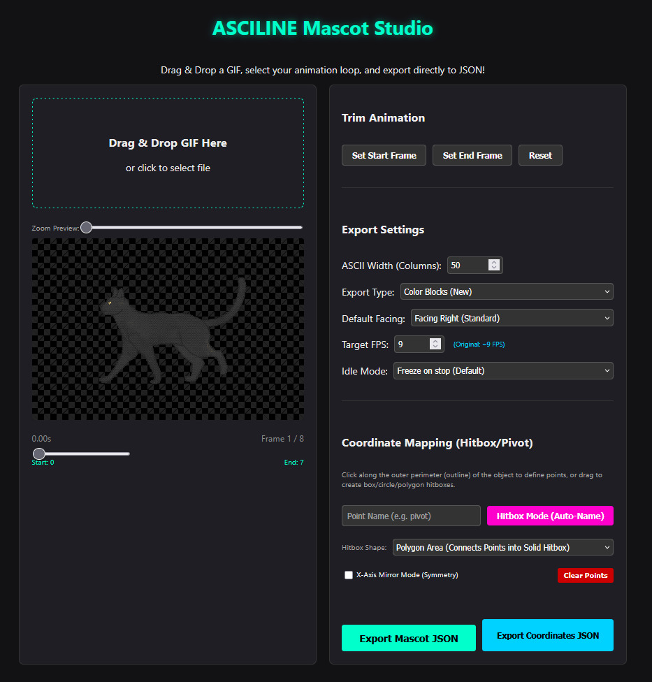

<div align="center">

# ASCILINE Mascots

<pre>
       _                        
       \`*-.                    
        )  _`-.                 
       .  : `. .                
       : _   '  \               
       ; *` _.   `*-._          
       `-.-'          `-.       
         ;       `       `.     
         :.       .        \    
         . \  .   :   .-'   .   
         '  `+.;  ;  '      :   
         :  '  |    ;       ;-. 
         ; '   : :`-:     _.`* ;
      .*' /  .*' ; .*`- +'  `*' 
      `*-*   `*-*  `*-*'
</pre>

**Bringing Spatial Awareness and Kinematics to HTML DOM Elements.**

<p align="center">
  <a href="https://github.com/YusufB5/ASCILINE-Mascots"></a>
  <a href="https://opensource.org/licenses/MIT"></a>
  <a href="https://github.com/YusufB5/ASCILINE-Mascots"></a>
</p>

<p align="center">
  <a href="https://yusufb5.github.io/ASCILINE-Mascots/example/"><strong>🎮 Try Live Interactive Demo</strong></a>
</p>

</div>

---

## 1. Philosophy: The Living Interaction Layer of the Web

Traditional web applications consist of three fundamental layers:
* **HTML:** Structure and semantics.
* **CSS:** Visual styling and responsive layout.
* **JavaScript:** Behavior, logic, and event handling.

In this standard model, DOM elements (`<h1>`, `<p>`, `<button>`) are static, two-dimensional surfaces oblivious to physical space and entity interactions.

**ASCILINE Mascots introduces The Living Interaction Layer to the Web.**

The engine turns standard text nodes and UI components into solid physical collision platforms using non-destructive browser APIs (`Range API`) without injecting wrapper tags or altering page SEO. Mascots patrol headings, jump across buttons, fall with real-time gravity, bounce off boundaries, and can be tossed via pointer momentum.

### Beyond Mascots: Entity & Scene Matrix

ASCILINE is not limited to walking pets. It is a full living entity and retro pixel-art engine for the DOM:

| Entity Type | Examples | Physics Style | Behavior |
| :--- | :--- | :--- | :--- |
| 🐾 **Autonomous Entities** | Walking pet, flying bird, jumping slime | Locomotion & Gravity | Patrols UI, climbs platforms, reacts to gravity |
| ⚔️ **Interactive Objects** | Bouncing ball, coffee cup, throwable item | Momentum & Action | Draggable items with collision, impact & actions |
| ☕ **Ambient Decors** | Looping fireplace, neon sign, desk lamp | Static (Zero-G) | Stationary animated object placed anywhere on page |
| 🌳 **Living Scenes** | Dog-under-tree vista, retro landscape | Static / Ambient | Multi-frame animated vista without heavy video memory |
| 🖼️ **Static Art & Logos** | Brand logo, retro badge, ASCII typography | Pure Sprite | Ultra-lightweight zero-CPU pixel art & typography |

---

## 2. Technical Architecture

ASCILINE Mascot Engine is built on a modular 4-tier object-oriented architecture designed for 60fps execution and zero external runtime dependencies.

```text
+------------------------------------------------------------------------+
|                      4. Hitbox & Overlay Layer                         |
|   (SVG Closed Polygon / Multi-Point / Rect / Circle Adaptive Overlay)  |
+------------------------------------------------------------------------+
|                 3. Kinematics & Locomotion State Machine               |
|   (Modular Lifecycle, State Machine, Organic Acceleration & Velocity)  |
+------------------------------------------------------------------------+
|                     2. Sprite & Rendering Engine                       |
| (Feature-Preserving Block Resampling, Frame Compositing, Span Cache)   |
+------------------------------------------------------------------------+
|                  1. Core Engine & Spatial DOM Kinematics               |
| (Range API Platform Sensing, Dynamic Cache Culling, Momentum Drag)     |
+------------------------------------------------------------------------+
```

### Layer 1: Base Physics Engine (`lib/core/mascot.js`)
* **Spatial DOM Sensing:** Uses native `document.createRange()` and `getClientRects()` to map non-destructive text nodes into solid collision platforms.
* **Dynamic Platform Caching:** Maintains `cachedStaticPlatforms` and `cachedDynamicElements` arrays with automatic `window.resize` recalculation.
* **Momentum Kinematics:** Tracks pointer movement in `dragHistory` (last 5 points) to compute dynamic release velocity vectors (`vx`, `vy`).
* **Accessibility Shield:** Holding `Alt` or pressing `Ctrl+A` activates `mascot-select-mode` to preserve underlying text selection.
* **Dual Budget Shield:** Prevents performance degradation via configurable credit and count limits (`ASCILINE_MAX_CREDITS`, `ASCILINE_MAX_COUNT`).

### Layer 2: Sprite & Matrix Renderer (`lib/core/sprite.js`)
* **Matrix Format Processing:** Parses 2D character arrays and HTML color matrix frames generated via the in-browser GIF Studio or Python CLI conversion tools.
* **Frame Compositing:** Pre-composites GIF frames to prevent ghosting artifacts across frame disposal states.
* **Feature-Preserving Resampling:** Prioritizes micro-details (e.g., character eyes) during grid downscaling.
* **HTML Frame Caching:** Converts matrix rows into efficient HTML `<span>` blocks with inline colors, caching processed HTML strings to minimize garbage collection pauses.

### Layer 3: Kinematics & Locomotion State Machine
* **Modular Physics Lifecycle (`tick(dt)`):** Provides a standardized, delta-time aware loop that subclasses override to implement custom behaviors.
* **State Machine Transitions:** Manages fluid transitions across `IDLE`, `WALK`, `FALL`, `DRAG`, and action states with organic acceleration and friction.
* **Directional Synchronization:** Automatically aligns horizontal velocity vectors (`vx`), orientation state (`facing`), sprite transformations (`scaleX(-1)`), and attached SVG overlays.

### Layer 4: Hitbox Overlay System
* Renders real-time SVG overlays (`<polygon>`, `<rect>`, `<circle>`) that mirror automatically on direction change (`scaleX(-1)`).

---

## 3. Quick Start

### 1. Include the Engine (Single-File Bundle)

```html
<!-- Recommended: All core engines, helpers, and physics behaviors in one line -->
<script src="dist/asciline.bundle.min.js"></script>
```

> **Note on Modular Script Loading (Without Bundle):** If loading individual scripts from `lib/`, you must maintain strict hierarchical dependency order:
> 1. `lib/core/mascot.js` *(Core Engine & Spatial DOM)*
> 2. `lib/core/sprite.js` *(Sprite & Matrix Renderer)*
> 3. `lib/physics/pure/helpers/physics_text.js` *(DOM Particle & Shatter Helpers)*
> 4. `lib/physics/pure/motion/*` or `action/*` *(Individual Locomotion & Combat Behaviors)*

### 2. Configure and Spawn Mascots

```javascript
// 1. Configure asset directory
ASCILINE.baseAssetUrl = 'assets/mascots/';

// 2. Configure collision platforms (Optional)
window.ASCILINE_CONFIG = {
    platformSelectors: 'h1, h2, h3, p, button, .platform-card'
};

// 3. Spawn registered mascots
ASCILINE.spawn('walker_cat');
ASCILINE.spawn('flying_cat');
```

### 3. Core Engine API Reference

| Method / Property | Type / Return | Description |
|---|---|---|
| `ASCILINE.spawn(name)` | `Object` | Spawns a registered mascot by identifier. |
| `ASCILINE.baseAssetUrl` | `String` | Global base URL for mascot JSON animations (e.g. `'assets/mascots/'` or CDN). |
| `ASCILINE.resolveAssetUrl(path)` | `String` | Resolves relative JSON asset filenames against `baseAssetUrl`. |
| `ASCILINE.registerMascot(name, config)` | `void` | Dynamically registers a custom mascot class and arguments. |
| `ASCILINE.unregisterMascot(name)` | `Boolean` | Removes a mascot from runtime registry (`true` on success, `false` if not found). |
| `ASCILINE.getRegisteredMascots()` | `Array<String>` | Returns a list of all currently registered mascot names. |
| `ASCILINE.clear_all()` | `void` | Destroys and removes all active mascots from the screen. |
| `ASCILINE.toggleDebug(layer)` | `void` | Toggles debug layers (`dragBoxes`, `hitboxes`, `platforms`, `fps`). |

---

## 4. Asset Conversion & Tooling

ASCILINE offers two complementary conversion workflows depending on your preferred artistic rendering style and pipeline needs:

### Option 1: Browser-Based GIF Studio (`tools/gif_studio.html`) — Visual & Detail-Preserving

<p align="center">
  
</p>

The in-browser studio provides interactive visual editing with a focus on **Block-Art Fidelity**:

* **Feature-Preserving Smart Resampling:** Retains high-contrast micro-details (e.g., character eyes, pupils) even at low resolutions (20–40 cols) without color bleed.
* **Temporal Subsampling & Frame Rate Optimization:** 
  * **Asset FPS (The Data Shell):** Controls frame subsampling and payload compression during compilation (e.g., downsampling a 60-frame GIF to 15 FPS to eliminate redundant frames and reduce JSON payload size by up to 75%).
  * **Runtime Engine (The Playback Driver):** Dynamically scales the playback velocity of this frame shell at 60fps according to engine delta-time (`dt`) and character locomotion momentum (`vx / walkSpeed`).
* **Accurate Frame Disposal Compositing:** Pre-composites GIF delta frames to eliminate ghosting artifacts across disposal modes.
* **Visual Hitbox Designer:** Click **Polygon Area** on the live canvas to draw precise SVG closed boundary hitboxes.
* **Workflow:**
  1. Open `tools/gif_studio.html` and drop your animated GIF.
  2. Adjust **Columns (Resolution)**, **Target FPS** (subsampling rate), and Idle behavior.
  3. Draw custom polygon hitboxes directly on the character canvas.
  4. Click **Export Mascot JSON** and register the asset in your app:

  ```javascript
  ASCILINE.registerMascot('my_mascot', {
      get_class: () => ASCILINE.Physics.Walker,
      args: ['my_mascot_coloranim.json', 80, 50, 15, 2]
  });

  ASCILINE.spawn('my_mascot');
  ```

### Option 2: Python CLI Conversion Pipeline (`tools/`) — Headless & Retro Monospace

For terminal lovers, CI/CD automated pipelines, and batch conversions:

* **Color Matrix Converter (`tools/gif2color.py`):** Converts GIFs into colored HTML span matrix JSON files with Lanczos downsampling.
  ```bash
  python tools/gif2color.py input.gif --cols 80 --fps 15 -o mascot_coloranim.json
  ```
* **Pure Text ASCII Converter (`tools/gif2text.py`):** Generates lightweight monochrome ASCII text matrix JSON files for classic retro terminals.
  ```bash
  python tools/gif2text.py input.gif --cols 60 --fps 12 -o mascot_textanim.json
  ```
* **GIF Inspector & Trimmer (`tools/gif_inspector.py` & `tools/gif_trimmer.py`):** Inspect frame delays, color palettes, and trim frame sequences.
  ```bash
  python tools/gif_inspector.py input.gif
  python tools/gif_trimmer.py input.gif --start 0 --end 10 -o trimmed.gif
  ```

#### CLI Parameter & Flag Reference

| Flag / Option | Short | Type | Default | Description |
| :--- | :--- | :--- | :--- | :--- |
| `input` | — | String | *Required* | Path to the input `.gif` file |
| `[width]` / `--cols` | `-w` | Integer | `40` | Output width in monospace character columns |
| `--fps` | — | Integer | *Auto* | Target sampling & playback FPS (subsamples frames automatically) |
| `-o` / `--output` | — | String | `[name]_anim.json` | Custom destination path for exported JSON |
| `--facing` | `--l` / `--r` | Enum | `right` | Native character facing orientation (`left` or `right`) |
| `--idle` | — | String | `freeze` | Idle playback behavior: `freeze` (pause on current), `play` (continuous loop), or frame index |

> **Idle Animation Modes (`idleMode`):**
> Controls what the character displays when stationary (not walking/moving). You can set this during JSON compilation (via GIF Studio or `--idle` flag) and dynamically override it at runtime in JavaScript (`mascot.idleMode = 'play'`):
> * `'freeze'` *(Default)*: Freezes on the current frame when stopping (ideal for walk/run cycles).
> * `'play'`: Plays the animation continuously even when stationary (ideal for ambient scenes, looping fireplaces, or breathing pets).
> * `<frame_index>` (e.g. `0`): Automatically snaps to a specific resting frame whenever idle.

---

## 5. Custom Mascots & Physics: 2 Practical Scenarios

ASCILINE Mascot Engine is designed to be fully modular and extensible. Whether you just want to load your own custom animated JSON mascot with existing physics, or build completely custom locomotion mechanics from scratch, use `ASCILINE.registerMascot()`:

### Scenario 1: Custom Mascot Asset (JSON) + Built-in Physics (`ASCILINE.Physics.*`)
*You generated a new animation JSON (e.g. `my_cat.json` via GIF Studio) and want to use one of ASCILINE's built-in physics modules (Walker, Flyer, Static, Jumper, etc.):*

```javascript
// 1. Register your custom mascot using any built-in physics module
ASCILINE.registerMascot('my_walker_cat', {
    get_class: () => ASCILINE.Physics.Walker,
    args: ['assets/my_cat.json', 60, 30, 15] // jsonUrl, width, height, fps
});

// 2. Spawn anywhere seamlessly!
ASCILINE.spawn('my_walker_cat');
```

> **Available Physics Modules:** All physics classes in `lib/physics/` (e.g. `Walker`, `Flyer`, `Static`, `Jumper`, `Runner`, `Bouncer`, `Swimmer`, `Bomb`, `Sword`, `BlackHole`, `Hand`, `Pokeball`) are automatically available under `ASCILINE.Physics`. You can inspect all loaded physics modules in the browser console:
> ```javascript
> console.log(ASCILINE.Physics);
> ```

---

### Scenario 2: Full Custom (Custom JSON + Custom Physics Class)
*You want to write brand-new unique locomotion or game physics behavior (e.g. a rocket that continuously flies upwards):*

```javascript
// 1. Define your custom physics class extending SpriteMascot
class RocketPhysics extends ASCILINE.SpriteMascot {
    constructor(jsonUrl, width = 80, height = 120, fps = 20) {
        super(jsonUrl, width, height, fps, 0, null);
        this.gravity = 0; // Disable falling
    }

    tick(dt = 1) {
        if (!this.isLoaded) return;
        super.tick(dt);

        // Custom propulsion behavior: fly upward continuously
        if (!this.isDragging) {
            this.y -= 4 * dt;
            if (this.y < -this.height) this.y = window.innerHeight; // Screen wrap
        }
        this.updateDOMPosition();
    }
}

// 2. Register your custom class into the engine
ASCILINE.registerMascot('space_rocket', {
    get_class: () => RocketPhysics,
    args: ['assets/rocket.json', 80, 120, 20]
});

// 3. Spawn like any native mascot!
ASCILINE.spawn('space_rocket');
```

Read the in-depth developer guide: [**Custom Physics Developer Guide (docs/CUSTOM_PHYSICS_GUIDE.md)**](docs/CUSTOM_PHYSICS_GUIDE.md)

---

## 6. Repository Structure

```text
ASCILINE-Mascots/
├── dist/                           # Single-file production bundles (asciline.bundle.min.js)
├── lib/
│   ├── core/                       # Core engine classes (mascot.js, sprite.js)
│   ├── physics/
│   │   ├── pure/
│   │   │   ├── motion/             # Locomotion (walking_sprite, flyer, jumper, runner, spider...)
│   │   │   ├── action/             # Interactive & combat (bomb_physics, sword_physics, pokeball...)
│   │   │   └── helpers/            # Particle & DOM shatter utilities (physics_text.js)
│   │   └── derived/                # Extended physics zones (blackhole_physics.js)
│   ├── interactive/                # Environmental trigger zones (sword_zone.js)
│   └── effects/                    # Audio & visual effect bridges
├── tools/                          # GIF Studio GUI and Python CLI tools
├── docs/                           # Developer guides (CUSTOM_PHYSICS_GUIDE.md)
└── example/                        # Interactive demo sandbox & assets
```

---

## 7. License

Distributed under the **MIT License**. See `LICENSE` for details.
